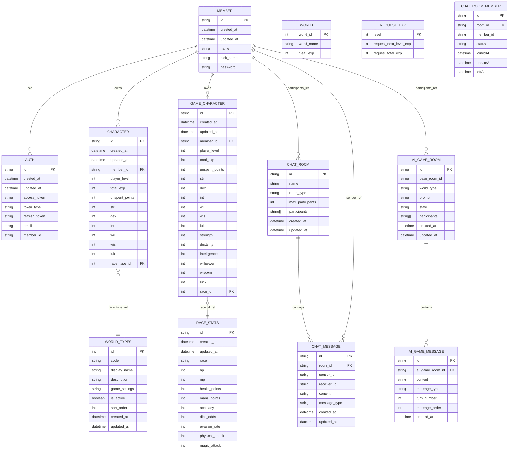

# 🎲 DungeonTalk

## 🕰️ 진행 기간
♠︎ **2025. 7. 29 ~ 2025. 8. 27** ♠︎

<br/>

## 📖 프로젝트 소개

- DungeonTalk는 AI와 함께하는 혁신적인 TRPG(테이블탑 롤플레잉 게임) 플랫폼입니다.
- 실시간 채팅을 통해 AI 게임마스터와 함께 특정 세계관에서의 모험을 즐길 수 있습니다.
- 플레이어는 직접 게임 속의 캐릭터가 되어 직접 스토리를 만들어 나가면서 다양한 상황을 체험할 수 있습니다.

<br/>

## 🎯 주요 특징

- 🤖 **AI 게임마스터**: 역동적이고 상호작용적인 TRPG Dungeontalk 게임의 진행을 담당하는 게임마스터
- ⚡ **실시간 통신**: WebSocket STOMP 기반 실시간 멀티플레이어 지원
- 🎮 **자유형 게임플레이**: 제약 없는 창의적인 롤플레잉 경험
- 🌍 **다양한 세계관**: 판타지, 좀비 아포칼립스 등의 테마로 구성
- 👥 **매칭 시스템**: 세계관별 자동 매칭 및 대기열 관리

<br/>

## 📸 프로젝트 이미지

### DungeonTalk 로그인 화면
<div align="center">


</div>

<br/>

### DungeonTalk 메인 화면
<div align="center">


</div>

<br/>

### AI와의 게임 진행 화면

<div align="center">


</div>

<br/>

### 캐릭터 생성 및 관리 화면

<div align="center">


</div>

<br/>

### 세계관별 매칭 화면

<div align="center">


</div>

<br/>

## 🧭 ERD - [설명 링크](https://github.com/DungeonTalk/dungeontalk-backend/wiki/%F0%9F%93%9A-ERD-%EC%A0%95%EB%B3%B4)




## 🏗️ 시스템 아키텍처

### 전반적인 흐름 구성도


<br/>

### 아키텍쳐 구성도


<br/>

## DungeonTalk 기능 상세 아키텍처

### 메시지 전송 플로우 (TALK)


| 계층(Layer)                | 주요 구성요소                                                                                                                         | 역할 요약                                                                      |
| ------------------------ | ------------------------------------------------------------------------------------------------------------------------------- | -------------------------------------------------------------------------- |
| **Client Layer**         | `WebSocket/STOMP Client`                                                                                                        | 클라이언트가 WebSocket(STOMP) 프로토콜로 서버와 실시간 통신 수행. REST API 및 STOMP 메시지 전송 역할.   |
| **Presentation Layer**   | `ChatRoomMemberController`, `ChatRoomController`, `ChatStompController`                                                         | REST API와 STOMP 엔드포인트를 담당하는 진입 계층. HTTP 요청과 WebSocket 요청을 분리 처리.           |
| **Service Layer**        | `ChatMessageService`, `ChatRoomService`, `ChatRoomMemberService`, `ChatSessionService`                                          | 비즈니스 로직 계층. 메시지 처리, 입장/퇴장 관리, 멤버 상태 관리, 세션 TTL 유지 등 핵심 도메인 로직을 수행.         |
| **Infrastructure Layer** | `KafkaSubscriber`, `KafkaPublisher`, `WebSocketDisconnectHandler`, `ChatPresenceSystemMessageListener`, `ChatRoomMemberManager` | 외부 시스템(메시지 브로커·WebSocket·Redis 등)과 통신하는 인프라 계층. 비동기 이벤트 처리 및 연결 관리 담당.     |
| **Persistence Layer**    | `MongoDB`, `Valkey/Redis`, `Kafka`                                                                                              | 데이터 저장 및 메시징 계층. MongoDB는 채팅 로그, Redis는 세션 및 접속자 상태, Kafka는 메시지 브로드캐스트 담당. |

<br/>

### 메시지 타입별 처리 플로우


### 입장 플로우 (JOIN)


| 단&#x2060;계&#x2060;     | 주체                     | 메서드 / 동작                                  | 설명                                              |
| ------ | ---------------------- | ----------------------------------------- | ----------------------------------------------- |
| **1**  | Client                 | `STOMP /pub/chat/send (type=TALK)`        | 클라이언트가 STOMP 프로토콜을 통해 채팅 메시지를 서버로 발행            |
| **2**  | ChatStompController    | `processMessage(dto)`                     | STOMP 메시지를 수신하여 DTO 변환 후 ChatMessageService에 전달 |
| **3**  | ChatMessageService     | `switch(type=TALK)`                       | 메시지 타입이 TALK일 경우 `handleTalkMessage()` 실행       |
| **4**  | ChatSessionService     | `extendSession(roomId, memberId)`         | 세션 TTL(1800초) 연장 — heartbeat 기반 세션 유지 로직        |
| **5**  | ChatMessageService     | `validateMessage(content)`                | ProfanityFilterService 호출 전 메시지 내용 검증           |
| **6**  | ProfanityFilterService | `filter(content)`                         | 비속어 감지 및 치환(필터링 처리)                             |
| **7**  | MongoDB                | `save(ChatMessage)`                       | MongoDB에 메시지 영구 저장 (비속어 필터링 이후 저장)              |
| **8**  | ChatMessageService     | `publishChatAsync(roomId, dto)`           | KafkaPublisher를 통해 비동기 브로드캐스트 요청                |
| **9**  | KafkaPublisher         | `@Async send(topic, roomId, message)`     | Kafka 토픽으로 메시지 발행(비동기 처리)                       |
| **10** | Kafka                  | `ack`                                     | 메시지 발행 성공 ACK 반환                                |
| **11** | KafkaSubscriber        | `consume(message)`                        | Kafka 토픽 메시지를 수신하고 WebSocket 브로드캐스트로 전달         |
| **12** | WebSocket              | `convertAndSend(/sub/chat/room/{roomId})` | 구독 중인 모든 클라이언트에게 메시지 전송                         |
| **13** | Client                 | `200 OK`                                  | 클라이언트는 서버로부터 메시지 전송 완료 응답 수신                    |


<br/>

### 퇴장 플로우 (LEAVE)


| 단&#x2060;계&#x2060;     | 주체                                | 메서드 / 동작                                                        | 설명                                                               |
| ------ | --------------------------------- | --------------------------------------------------------------- | ---------------------------------------------------------------- |
| **1**  | Client                            | `STOMP /pub/chat/send (type=LEAVE)` 또는 `SessionDisconnectEvent` | 클라이언트가 퇴장 메시지를 전송하거나, WebSocket 연결이 끊어짐                          |
| **2**  | WebSocketDisconnectHandler        | `SessionDisconnectEvent` 수신                                     | 비정상 연결 종료 감지 후 `ChatRoomService.leaveRoom()` 호출                  |
| **3**  | ChatRoomService                   | `leaveRoom(roomId, memberId)`                                   | 퇴장 로직 진입 — 세션 종료 및 멤버 제거 처리                                      |
| **4**  | ChatSessionService                | `endSession(roomId, memberId)`                                  | Redis(Valkey)에 저장된 세션 key(`chat:session:{roomId}:{memberId}`) 삭제 |
| **5**  | Valkey                            | `DEL chat:session:{roomId}:{memberId}`                          | 세션 데이터 제거 (`1 deleted`)                                          |
| **6**  | ChatRoomMemberManager             | `removeUser(roomId, memberId)`                                  | Redis에서 사용자 목록에서 제거                                              |
| **7**  | Valkey                            | `SREM chat:room:{roomId}:users [memberId]`                      | 참여자 목록(Set)에서 멤버 제거                                              |
| **8**  | Valkey                            | `HDEL chat:room:{roomId}:nicks [memberId]`                      | 닉네임 매핑(Hash)에서도 제거                                               |
| **9**  | ChatRoomService                   | `markOffline(roomId, memberId)`                                 | 해당 사용자를 오프라인 상태로 표시                                              |
| **10** | ChatRoomMemberService             | `update ChatRoomMember(status=OFFLINE)`                         | MongoDB에 저장된 멤버 상태를 “OFFLINE”으로 변경                               |
| **11** | ChatRoomMemberService             | `publishEvent(ChatPresenceEvent type=LEAVE)`                    | 퇴장 이벤트 발행 (Spring EventPublisher 사용)                             |
| **12** | EventPublisher                    | `publishEvent()` → 대기열 등록                                       | `@TransactionalEventListener(AFTER_COMMIT)`로 전달됨                 |
| **13** | ChatPresenceSystemMessageListener | `onPresence(ChatPresenceEvent)`                                 | 트랜잭션 커밋 이후 이벤트 수신                                                |
| **14** | MongoDB                           | `save("퇴장했습니다.")`                                               | 시스템 메시지(`퇴장 알림`) 저장                                              |
| **15** | Valkey                            | `Redis Pub/Sub 발행(메시지)`                                         | “퇴장 알림” 이벤트를 Redis Pub/Sub을 통해 모든 서버에 전파                         |
| **16** | ChatRoomService                   | `broadcastPresence(roomId, "LEAVE")`                            | WebSocket을 통해 현재 채팅방에 접속한 모든 사용자에게 브로드캐스트                        |
| **17** | Client                            | `WebSocket으로 Presence 브로드캐스트 수신`                                | 클라이언트가 퇴장 알림 메시지를 수신하고 UI 갱신                                     |

<br/>

### 세션 관리 생명주기


| 이벤트                               | 상태 전이              | 설명                                                     |
| --------------------------------- | ------------------ | ------------------------------------------------------ |
| `startSession()`                  | NotExist → Active  | 사용자가 WebSocket 연결을 시작할 때 호출. 세션 생성 (`SET key EX 1800`) |
| `heartbeat()` / `extendSession()` | Active → Active    | 일정 주기로 TTL 갱신. 메시지 전송 시에도 호출되어 `EXPIRE key 1800`       |
| TTL 만료 (30분)                      | Active → Expired   | 비정상 종료나 heartbeat 중단 시 자동 만료 처리                        |
| `endSession()`                    | Active → NotExist  | 사용자가 명시적으로 퇴장 시 key 삭제 (`DEL key`)                     |
| `Valkey 자동 삭제`                    | Expired → NotExist | TTL 종료 후 key 자동 제거. 메모리 누수 방지                          |
| TTL 만료 + 퇴장 정리                    | NotExist → Expired | 비정상 종료 후 자동 청소 프로세스(30분 내)                             |

<br/>

### 컴포넌트 의존성 관계도


| 계층                   | 구성 요소                                                                                                                           | 주요 역할 및 책임                                                                                                                                                                                                                                                                                                                                                |
| -------------------- | ------------------------------------------------------------------------------------------------------------------------------- | --------------------------------------------------------------------------------------------------------------------------------------------------------------------------------------------------------------------------------------------------------------------------------------------------------------------------------------------------------- |
| **Controllers**      | `ChatRoomController`, `ChatStompController`, `ChatRoomMemberController`                                                         | <ul><li>REST 및 STOMP 요청을 진입점에서 처리</li><li>`ChatRoomController`: 채팅방 생성·조회 API</li><li>`ChatStompController`: `/pub/chat/send`를 통해 실시간 메시지 발행</li><li>`ChatRoomMemberController`: 멤버 상태 조회 및 관리 API</li></ul>                                                                                                                                              |
| **Services**         | `ChatMessageService`, `ChatRoomService`, `ChatRoomMemberService`, `ChatSessionService`                                          | <ul><li>비즈니스 로직 핵심 계층</li><li>`ChatMessageService`: 메시지 검증·저장·Kafka 발행</li><li>`ChatRoomService`: 방 입장/퇴장, Presence 관리</li><li>`ChatRoomMemberService`: 멤버 상태 업데이트 및 이벤트 발행</li><li>`ChatSessionService`: Redis 기반 세션 TTL 관리 및 연장</li></ul>                                                                                                               |
| **Infrastructure**   | `WebSocketDisconnectHandler`, `ChatRoomMemberManager`, `KafkaPublisher`, `KafkaSubscriber`, `ChatPresenceSystemMessageListener` | <ul><li>실시간 통신, 이벤트 전송, 외부 리소스 연동 담당</li><li>`WebSocketDisconnectHandler`: 연결 종료 이벤트 감지 및 세션 정리</li><li>`ChatRoomMemberManager`: Redis Set/Hash로 온라인 멤버 관리</li><li>`KafkaPublisher`: Kafka 토픽 비동기 발행</li><li>`KafkaSubscriber`: Kafka 메시지 소비 후 WebSocket으로 브로드캐스트</li><li>`ChatPresenceSystemMessageListener`: Redis Pub/Sub 기반 Presence 메시지 처리</li></ul> |
| **External Systems** | `Valkey`, `Kafka`, `MongoDB`                                                                                                    | <ul><li>`Valkey`: 세션 관리(키 TTL, 접속자 상태 캐시)</li><li>`Kafka`: 메시지 비동기 전송 및 다중 서버 브로드캐스트</li><li>`MongoDB`: 채팅 메시지 및 멤버 데이터 영속 저장</li></ul>                                                                                                                                                                                                                   |


<br/>

### CI/CD 구성도


<br/>

## 🛠️ 기술 스택

| 구분               | 기술/도구                                                             |
| ---------------- | ----------------------------------------------------------------- |
| **Frontend** | HTML, CSS, JavaScript, Thymeleaf, SockJS |
| **Backend** | Java 21 (LTS), Spring Boot 3.4.0, Spring Security, JWT            |
| **DataBase**       | PostgreSQL 17 (pgvector 지원), MongoDB 7.0, Redis(Valkey) - (캐시/세션) |
| **Main Tech Stack**       | WebSocket, STOMP, Redis (Valkey) Pub/Sub, RAG                                   |
| **Dev Tools**        | Swagger/OpenAPI (API 문서화), JUnit 5, Mockito, Docker (컨테이너화), Discord          |

<br/>

## 📁 프로젝트 구조

```
src/
├── main/
│   ├── java/org/com/dungeontalk/
│   │   ├── domain/                 # 도메인별 패키지
│   │   │   ├── aichat/            # AI 채팅 시스템
│   │   │   ├── auth/              # 인증/인가
│   │   │   ├── chat/              # 일반 채팅
│   │   │   ├── matching/          # 매칭 시스템
│   │   │   ├── gamecharacter/     # 게임 캐릭터
│   │   │   └── ...
│   │   ├── global/                # 전역 설정
│   │   │   ├── config/           # 설정 클래스
│   │   │   ├── security/         # 보안 설정
│   │   │   ├── websocket/        # WebSocket 설정
│   │   │   └── exception/        # 예외 처리
│   │   └── web/                  # 웹 컨트롤러
│   └── resources/
│       ├── application*.properties  # 환경별 설정
│       ├── static/                 # 정적 파일
│       └── templates/              # 템플릿 파일
└── test/                          # 테스트 코드
```

<br/>

## 🗂 더 알아보고 싶은 내용이 있다면?
더 궁금한 내용이 있으시면 아래를 참고해주세요.
- 협업 방식을 알고 싶다. 👉 [협업 가이드 바로가기](https://github.com/DungeonTalk/dungeontalk-backend/wiki/%F0%9F%93%9C-%ED%98%91%EC%97%85-%EA%B0%80%EC%9D%B4%EB%93%9C)
- Moodbook의 Github Project. 👉[Github Project 바로가기](https://github.com/orgs/DungeonTalk/projects/1/views/1)
- 도메인별 API 상세정보가 궁금하다. 👉 [DungeonTalk API 문서 바로가기](https://github.com/DungeonTalk/dungeontalk-backend/wiki/DungeonTalk-API-%EB%AC%B8%EC%84%9C)
- 사용한 기술 스택이 궁금하다. 👉 [기술 스택 바로가기](https://github.com/DungeonTalk/dungeontalk-backend/wiki/%F0%9F%94%A8-%EA%B0%9C%EB%B0%9C-%ED%99%98%EA%B2%BD-%EA%B5%AC%EC%84%B1-&-%EA%B8%B0%EC%88%A0-%EC%8A%A4%ED%83%9D)
- 주요 기능 개발 과정이 궁금하다. 👉 [기술 상세 정보 바로가기](https://github.com/DungeonTalk/dungeontalk-backend/wiki/DungeonTalk-%ED%99%9C%EC%9A%A9-%EA%B8%B0%EC%88%A0)
- 활용한 디자인 패턴에 대해 알고 싶다. 👉 [DungeonTalk에서 활용한 디자인 패턴 바로가기](https://github.com/DungeonTalk/dungeontalk-backend/wiki/DungeonTalk%EC%97%90%EC%84%9C-%ED%99%9C%EC%9A%A9%ED%95%9C-%EB%94%94%EC%9E%90%EC%9D%B8-%ED%8C%A8%ED%84%B4)
- CI/CD 구성 절차가 궁금하다. 👉 [CI-CD 구성 바로가기](https://github.com/DungeonTalk/dungeontalk-backend/wiki/Dungeontalk-CI%E2%80%90CD-%EA%B5%AC%EC%84%B1)
- ERD와 DB 정보에 대해 궁금하다. 👉 [ERD 정보 바로가기](https://github.com/DungeonTalk/dungeontalk-backend/wiki/%F0%9F%93%9A-ERD-%EC%A0%95%EB%B3%B4)
- 트러블 슈팅에 대한 내용이 궁금하다. 👉 [트러블 슈팅 바로가기](https://github.com/DungeonTalk/dungeontalk-backend/wiki/DungeonTalk-%ED%8A%B8%EB%9F%AC%EB%B8%94-%EC%8A%88%ED%8C%85)
- 프로젝트 진행 과정에 대한 내용이 궁금하다. 👉 [DungeonTalk 기술 블로그](https://github.com/DungeonTalk/dungeontalk-backend/wiki/DungeonTalk-%EA%B8%B0%EC%88%A0-%EB%B8%94%EB%A1%9C%EA%B7%B8)
- 도메인별 테스트 코드 내용이 궁금하다. 👉 [DungeonTalk 도메인별 테스트 코드 작성](https://github.com/DungeonTalk/dungeontalk-backend/wiki/%EB%8F%84%EB%A9%94%EC%9D%B8%EB%B3%84-%ED%85%8C%EC%8A%A4%ED%8A%B8-%EC%A7%84%ED%96%89)

기타 다른 내용들은 [📝 팀 위키](https://github.com/DungeonTalk/dungeontalk-backend/wiki) 에서 확인할 수 있습니다.
