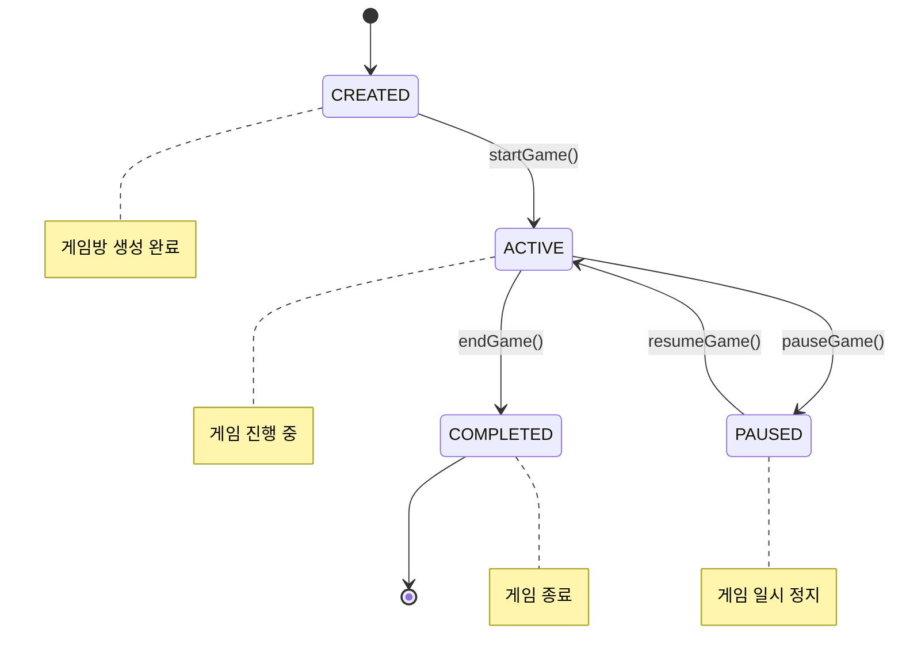
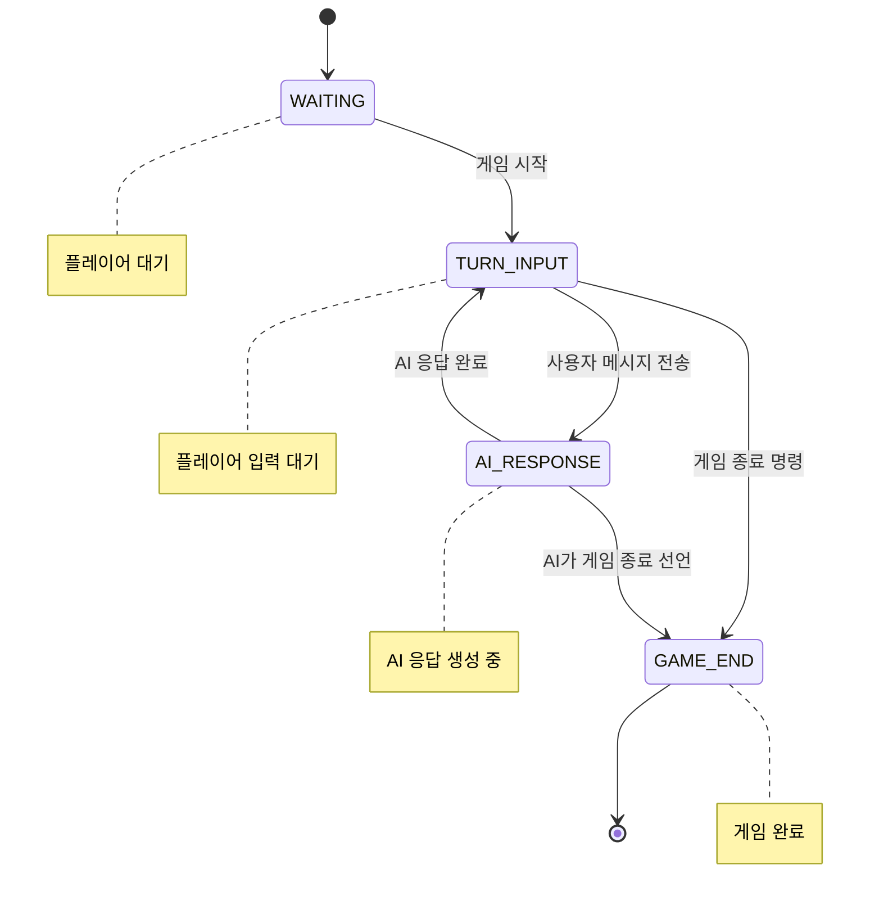

# 🎮 AI Chat Game Logic Documentation

## 게임 시스템 개요

AI Chat 시스템은 턴 기반의 멀티플레이어 텍스트 RPG 게임 로직을 제공합니다. 플레이어들이 텍스트로 행동을 입력하면 AI가 게임 마스터 역할을 하여 이야기를 진행합니다.

## 🔄 게임 상태 머신

### 게임방 상태 (GameStatus)



### 게임 페이즈 (GamePhase)



## 🎯 핵심 게임 로직

### 1. 게임방 생성 및 관리

#### 게임방 생성 규칙
```java
public class AiGameRoomService {
    
    // 게임방 생성 로직
    public AiGameRoomResponse createGameRoom(AiGameRoomCreateRequest request, String creatorId) {
        // 1. 중복 게임 확인
        validateDuplicateGame(request.getGameId(), creatorId);
        
        // 2. 게임방 생성
        AiGameRoom gameRoom = AiGameRoom.builder()
            .gameId(request.getGameId())
            .title(request.getTitle())
            .description(request.getDescription())
            .maxParticipants(request.getMaxParticipants())
            .status(GameStatus.CREATED)
            .phase(GamePhase.WAITING)
            .createdBy(creatorId)
            .participants(List.of(creatorId))
            .turnNumber(0)
            .build();
        
        return convertToResponse(gameRoomRepository.save(gameRoom));
    }
    
    // 중복 게임 검증
    private void validateDuplicateGame(String gameId, String userId) {
        boolean hasActiveGame = gameRoomRepository.existsByGameIdAndStatusAndCreatedBy(
            gameId, GameStatus.ACTIVE, userId);
        
        if (hasActiveGame) {
            throw new DuplicateGameException("이미 진행 중인 게임이 있습니다");
        }
    }
}
```

#### 게임방 참여 규칙
```java
public void joinGameRoom(String roomId, String userId) {
    AiGameRoom gameRoom = findGameRoomById(roomId);
    
    // 1. 참여 가능 상태 확인
    validateJoinable(gameRoom, userId);
    
    // 2. 참여자 추가
    gameRoom.addParticipant(userId);
    
    // 3. 시스템 메시지 발송
    publishSystemMessage(roomId, userId + "님이 게임방에 참여했습니다");
}

private void validateJoinable(AiGameRoom gameRoom, String userId) {
    // 게임 상태 확인
    if (gameRoom.getStatus() == GameStatus.COMPLETED) {
        throw new GameException("종료된 게임방입니다");
    }
    
    // 최대 인원 확인
    if (gameRoom.getParticipants().size() >= gameRoom.getMaxParticipants()) {
        throw new GameException("참여 인원이 가득 찼습니다");
    }
    
    // 중복 참여 확인
    if (gameRoom.getParticipants().contains(userId)) {
        throw new GameException("이미 참여 중인 게임방입니다");
    }
}
```

### 2. 턴 기반 게임 진행

#### 턴 시스템
```java
public class GameTurnManager {
    
    // 게임 시작
    public void startGame(String roomId, String creatorId) {
        AiGameRoom gameRoom = findGameRoomById(roomId);
        
        // 권한 확인
        validateGameCreator(gameRoom, creatorId);
        
        // 게임 상태 변경
        gameRoom.setStatus(GameStatus.ACTIVE);
        gameRoom.setPhase(GamePhase.TURN_INPUT);
        gameRoom.setTurnNumber(1);
        gameRoom.setStartedAt(LocalDateTime.now());
        
        gameRoomRepository.save(gameRoom);
        
        // 게임 시작 알림
        publishSystemMessage(roomId, "🎮 게임이 시작되었습니다! 첫 번째 행동을 입력해주세요.");
    }
    
    // 사용자 턴 처리
    public void processUserTurn(String roomId, String userId, String message) {
        AiGameRoom gameRoom = findGameRoomById(roomId);
        
        // 턴 입력 가능 상태 확인
        validateTurnInput(gameRoom, userId);
        
        // 사용자 메시지 저장
        AiMessage userMessage = saveUserMessage(roomId, userId, message, gameRoom.getTurnNumber());
        
        // 게임 페이즈 변경: TURN_INPUT → AI_RESPONSE
        gameRoom.setPhase(GamePhase.AI_RESPONSE);
        gameRoomRepository.save(gameRoom);
        
        // 실시간 메시지 발송
        publishUserMessage(userMessage);
    }
    
    private void validateTurnInput(AiGameRoom gameRoom, String userId) {
        if (gameRoom.getStatus() != GameStatus.ACTIVE) {
            throw new GameException("게임이 진행 중이 아닙니다");
        }
        
        if (gameRoom.getPhase() != GamePhase.TURN_INPUT) {
            throw new GameException("현재 입력을 받을 수 없습니다. AI가 응답 중입니다.");
        }
        
        if (!gameRoom.getParticipants().contains(userId)) {
            throw new GameException("게임에 참여하지 않은 사용자입니다");
        }
    }
}
```

#### AI 응답 처리
```java
public class AiTurnProcessor {
    
    // AI 턴 처리
    public void processAiTurn(String roomId) {
        AiGameRoom gameRoom = findGameRoomById(roomId);
        
        // AI 응답 생성 상태 확인
        validateAiTurn(gameRoom);
        
        // 분산 락 획득 (중복 처리 방지)
        String lockKey = "aichat:ai-response:" + roomId;
        if (!valkeyService.tryLock(lockKey, 30000)) {
            throw new ConcurrencyException("AI 응답이 이미 처리 중입니다");
        }
        
        try {
            // AI 응답 생성
            AiResponseResult aiResult = aiResponseService.generateAiResponse(roomId, gameRoom.getGameId());
            
            // AI 메시지 저장
            AiMessage aiMessage = saveAiMessage(roomId, aiResult, gameRoom.getTurnNumber());
            
            // 턴 번호 증가 및 페이즈 변경
            gameRoom.setTurnNumber(gameRoom.getTurnNumber() + 1);
            gameRoom.setPhase(GamePhase.TURN_INPUT);
            gameRoomRepository.save(gameRoom);
            
            // 실시간 AI 응답 발송
            publishAiMessage(aiMessage);
            
            // 게임 종료 조건 확인
            checkGameEndCondition(gameRoom, aiResult);
            
        } finally {
            valkeyService.releaseLock(lockKey);
        }
    }
    
    private void checkGameEndCondition(AiGameRoom gameRoom, AiResponseResult aiResult) {
        // AI가 게임 종료를 제안하는 경우
        if (containsGameEndKeywords(aiResult.getAiResponse())) {
            gameRoom.setPhase(GamePhase.GAME_END);
            gameRoomRepository.save(gameRoom);
            
            publishSystemMessage(gameRoom.getId(), "🏁 AI가 게임 종료를 선언했습니다.");
        }
        
        // 최대 턴 수 도달
        if (gameRoom.getTurnNumber() >= MAX_TURNS) {
            endGame(gameRoom.getId(), "SYSTEM");
        }
    }
    
    private boolean containsGameEndKeywords(String aiResponse) {
        String[] endKeywords = {"게임 종료", "모험 완료", "임무 완수", "The End"};
        String lowerResponse = aiResponse.toLowerCase();
        
        return Arrays.stream(endKeywords)
            .anyMatch(keyword -> lowerResponse.contains(keyword.toLowerCase()));
    }
}
```

### 3. 메시지 시스템

#### 메시지 타입별 처리
```java
public enum MessageType {
    USER("USER", "사용자 메시지"),
    AI("AI", "AI 응답"),
    SYSTEM("SYSTEM", "시스템 메시지");
    
    private final String code;
    private final String description;
}

public class AiMessageService {
    
    // 사용자 메시지 저장
    public AiMessage saveUserMessage(String roomId, String sender, String content, int turnNumber) {
        AiMessage message = AiMessage.builder()
            .roomId(roomId)
            .messageType(MessageType.USER)
            .sender(sender)
            .content(content)
            .turnNumber(turnNumber)
            .messageOrder(getNextMessageOrder(roomId))
            .timestamp(LocalDateTime.now())
            .build();
        
        return aiMessageRepository.save(message);
    }
    
    // AI 메시지 저장
    public AiMessage saveAiMessage(String roomId, AiResponseResult aiResult, int turnNumber) {
        AiMessage message = AiMessage.builder()
            .roomId(roomId)
            .messageType(MessageType.AI)
            .sender("AI")
            .content(aiResult.getAiResponse())
            .turnNumber(turnNumber)
            .messageOrder(getNextMessageOrder(roomId))
            .aiSource(aiResult.getModelInfo().getModelName())
            .processingTime(aiResult.getProcessingTimeMs())
            .timestamp(LocalDateTime.now())
            .build();
        
        return aiMessageRepository.save(message);
    }
    
    // 메시지 순서 관리
    private int getNextMessageOrder(String roomId) {
        return aiMessageRepository.countByRoomId(roomId) + 1;
    }
}
```

### 4. 컨텍스트 관리

#### 대화 컨텍스트 구성
```java
public class ContextMessageBuilder {
    
    private static final int MAX_CONTEXT_MESSAGES = 20;
    private static final int CONTEXT_SUMMARY_THRESHOLD = 50;
    
    // AI용 컨텍스트 메시지 구성
    public List<ContextMessage> buildContextMessages(String roomId) {
        List<AiMessage> recentMessages = getRecentMessages(roomId);
        
        // 메시지가 많은 경우 요약 처리
        if (recentMessages.size() > CONTEXT_SUMMARY_THRESHOLD) {
            return buildSummarizedContext(roomId, recentMessages);
        }
        
        // 최근 메시지를 컨텍스트로 변환
        return recentMessages.stream()
            .limit(MAX_CONTEXT_MESSAGES)
            .map(this::convertToContextMessage)
            .collect(Collectors.toList());
    }
    
    // 요약된 컨텍스트 생성
    private List<ContextMessage> buildSummarizedContext(String roomId, List<AiMessage> messages) {
        List<ContextMessage> contextMessages = new ArrayList<>();
        
        // 1. 게임 시작 메시지 (항상 포함)
        contextMessages.addAll(getGameStartContext(messages));
        
        // 2. 중간 요약 메시지
        String summary = summarizeMiddleMessages(messages);
        if (!summary.isEmpty()) {
            contextMessages.add(ContextMessage.builder()
                .messageType("SUMMARY")
                .content("[이전 상황 요약] " + summary)
                .build());
        }
        
        // 3. 최근 메시지들 (상세)
        contextMessages.addAll(getRecentDetailedContext(messages));
        
        return contextMessages;
    }
    
    private String summarizeMiddleMessages(List<AiMessage> messages) {
        // 중간 메시지들을 요약하는 로직
        List<AiMessage> middleMessages = messages.subList(5, messages.size() - 10);
        
        StringBuilder summary = new StringBuilder();
        for (AiMessage message : middleMessages) {
            if (message.getMessageType() == MessageType.AI) {
                // AI 응답에서 핵심 정보 추출
                summary.append(extractKeyInfo(message.getContent())).append(" ");
            }
        }
        
        return summary.toString().trim();
    }
    
    private String extractKeyInfo(String aiResponse) {
        // 핵심 정보 추출 로직 (키워드 기반)
        String[] keyPatterns = {
            "발견했다", "얻었다", "만났다", "도착했다", 
            "전투", "대화", "선택", "이동"
        };
        
        return Arrays.stream(keyPatterns)
            .filter(pattern -> aiResponse.contains(pattern))
            .map(pattern -> extractSentenceWith(aiResponse, pattern))
            .filter(Objects::nonNull)
            .collect(Collectors.joining(". "));
    }
}
```

### 5. 게임 종료 처리

#### 게임 종료 로직
```java
public class GameEndProcessor {
    
    public void endGame(String roomId, String requesterId) {
        AiGameRoom gameRoom = findGameRoomById(roomId);
        
        // 종료 권한 확인
        validateEndGamePermission(gameRoom, requesterId);
        
        // 게임 상태 변경
        gameRoom.setStatus(GameStatus.COMPLETED);
        gameRoom.setPhase(GamePhase.GAME_END);
        gameRoom.setEndedAt(LocalDateTime.now());
        
        // 게임 통계 계산
        GameStatistics stats = calculateGameStatistics(gameRoom);
        gameRoom.setStatistics(stats);
        
        gameRoomRepository.save(gameRoom);
        
        // 종료 메시지 발송
        publishGameEndMessage(gameRoom, stats);
        
        // 리소스 정리
        cleanupGameResources(roomId);
    }
    
    private GameStatistics calculateGameStatistics(AiGameRoom gameRoom) {
        List<AiMessage> messages = aiMessageRepository.findByRoomIdOrderByTimestamp(gameRoom.getId());
        
        return GameStatistics.builder()
            .totalTurns(gameRoom.getTurnNumber())
            .totalMessages(messages.size())
            .userMessageCount((int) messages.stream().filter(m -> m.getMessageType() == MessageType.USER).count())
            .aiMessageCount((int) messages.stream().filter(m -> m.getMessageType() == MessageType.AI).count())
            .averageResponseTime(calculateAverageResponseTime(messages))
            .playDuration(Duration.between(gameRoom.getStartedAt(), gameRoom.getEndedAt()))
            .participants(gameRoom.getParticipants())
            .build();
    }
    
    private void publishGameEndMessage(AiGameRoom gameRoom, GameStatistics stats) {
        String endMessage = String.format(
            """
            🏁 게임이 종료되었습니다!
            
            📊 게임 통계:
            • 총 턴 수: %d턴
            • 총 메시지: %d개
            • 플레이 시간: %s
            • 참여자: %s
            
            게임을 플레이해 주셔서 감사합니다! 🎉
            """,
            stats.getTotalTurns(),
            stats.getTotalMessages(),
            formatDuration(stats.getPlayDuration()),
            String.join(", ", stats.getParticipants())
        );
        
        publishSystemMessage(gameRoom.getId(), endMessage);
    }
    
    private void cleanupGameResources(String roomId) {
        // Redis 캐시 정리
        valkeyService.deletePattern("aichat:" + roomId + ":*");
        
        // WebSocket 세션 정리 (선택적)
        // sessionManager.closeRoomSessions(roomId);
    }
}
```

## 🎲 게임 규칙 및 제약사항

### 기본 규칙
1. **턴 제한**: 최대 100턴까지 진행 가능
2. **메시지 길이**: 사용자 메시지 최대 1,000자
3. **응답 시간**: AI 응답 최대 30초 타임아웃
4. **참여자 수**: 게임방당 최대 6명 참여 가능

### 게임 진행 제약사항
```java
public class GameRuleValidator {
    
    private static final int MAX_TURNS = 100;
    private static final int MAX_MESSAGE_LENGTH = 1000;
    private static final int MIN_MESSAGE_LENGTH = 1;
    private static final long TURN_TIMEOUT_MINUTES = 5;
    
    public void validateUserInput(String message, AiGameRoom gameRoom) {
        // 메시지 길이 검증
        if (message.length() < MIN_MESSAGE_LENGTH) {
            throw new ValidationException("메시지를 입력해주세요");
        }
        
        if (message.length() > MAX_MESSAGE_LENGTH) {
            throw new ValidationException("메시지가 너무 깁니다 (최대 " + MAX_MESSAGE_LENGTH + "자)");
        }
        
        // 턴 수 제한 검증
        if (gameRoom.getTurnNumber() >= MAX_TURNS) {
            throw new GameException("최대 턴 수에 도달했습니다. 게임을 종료합니다.");
        }
        
        // 비속어 필터링 (선택적)
        if (containsProfanity(message)) {
            throw new ValidationException("부적절한 내용이 포함되어 있습니다");
        }
    }
    
    public void validateTurnTimeout(AiGameRoom gameRoom) {
        if (gameRoom.getLastActivityAt() != null) {
            long minutesSinceLastActivity = Duration.between(
                gameRoom.getLastActivityAt(), 
                LocalDateTime.now()
            ).toMinutes();
            
            if (minutesSinceLastActivity > TURN_TIMEOUT_MINUTES) {
                // 자동 게임 종료 또는 일시 정지
                pauseGameDueToInactivity(gameRoom);
            }
        }
    }
}
```

### 특수 명령어 처리
```java
public class SpecialCommandProcessor {
    
    private static final Map<String, String> SPECIAL_COMMANDS = Map.of(
        "/help", "도움말을 표시합니다",
        "/status", "현재 게임 상태를 표시합니다",
        "/quit", "게임을 종료합니다",
        "/save", "게임을 저장합니다"
    );
    
    public boolean isSpecialCommand(String message) {
        return message.startsWith("/") && SPECIAL_COMMANDS.containsKey(message.split(" ")[0]);
    }
    
    public void processSpecialCommand(String command, String roomId, String userId) {
        String[] parts = command.split(" ");
        String cmd = parts[0];
        
        switch (cmd) {
            case "/help":
                publishHelpMessage(roomId);
                break;
                
            case "/status":
                publishStatusMessage(roomId);
                break;
                
            case "/quit":
                requestGameEnd(roomId, userId);
                break;
                
            case "/save":
                saveGameProgress(roomId);
                break;
                
            default:
                publishErrorMessage(roomId, "알 수 없는 명령어입니다: " + cmd);
        }
    }
    
    private void publishHelpMessage(String roomId) {
        String helpText = """
            🎮 게임 도움말
            
            기본 명령어:
            • /help - 이 도움말을 표시
            • /status - 현재 게임 상태 확인
            • /quit - 게임 종료 요청
            • /save - 게임 진행 상황 저장
            
            게임 방법:
            1. 자연스러운 문장으로 행동을 입력하세요
            2. AI가 상황을 해석하고 결과를 알려줍니다
            3. 다른 플레이어들과 협력하여 모험을 진행하세요
            """;
            
        publishSystemMessage(roomId, helpText);
    }
}
```

이제 AI Chat 시스템의 게임 로직이 완전히 문서화되었습니다! 🎮