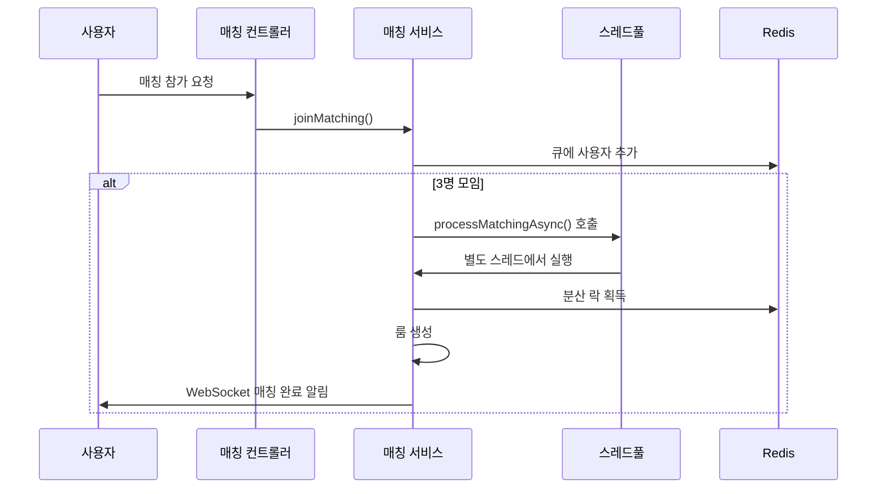

# 매칭 시스템 스레드풀 가이드

## 개요

DungeonTalk 백엔드에서는 매칭 처리의 성능과 안정성을 위해 전용 스레드풀을 사용합니다.
이 문서는 매칭 전용 스레드풀의 설계와 동작 원리를 설명합니다.

## 스레드풀 설정

### 1. 기본 구성 (`MatchingAsyncConfig.java`)

```java
@Bean(name = "matchingTaskExecutor")
public Executor matchingTaskExecutor() {
    ThreadPoolTaskExecutor executor = new ThreadPoolTaskExecutor();
    executor.setCorePoolSize(2);           // 기본 스레드 2개
    executor.setMaxPoolSize(10);           // 최대 스레드 10개  
    executor.setQueueCapacity(50);         // 대기 큐 50개
    executor.setKeepAliveSeconds(60);      // 유휴 스레드 60초 유지
    executor.setThreadNamePrefix("Matching-Async-");
    executor.setRejectedExecutionHandler((runnable, threadPoolExecutor) -> {
        log.warn("매칭 처리 스레드 풀이 가득 참. 요청 거부됨");
        runnable.run(); // 메인 스레드에서 동기 실행
    });
    return executor;
}
```

### 2. 스레드풀 파라미터

| 파라미터 | 값 | 설명 |
|---------|-----|------|
| `corePoolSize` | 2 | 항상 유지되는 기본 스레드 수 |
| `maxPoolSize` | 10 | 최대 스레드 수 |
| `queueCapacity` | 50 | 대기 큐 크기 |
| `keepAliveSeconds` | 60 | 유휴 스레드 유지 시간 (초) |
| `threadNamePrefix` | "Matching-Async-" | 스레드 이름 접두사 |

## 동작 원리

### 1. 스레드 할당 순서

```
1. 요청 발생
2. Core Pool (2개) 스레드가 여유 있음 → 즉시 할당
3. Core Pool 가득참 → Queue (50개)에 대기
4. Queue 가득참 → Max Pool (10개)까지 스레드 증가
5. Max Pool 가득참 → RejectedExecutionHandler 실행
```

### 2. 실제 사용 예시

```java
// MatchingService.java
@Async("matchingTaskExecutor")
public void processMatchingAsync(WorldType worldType) {
    try {
        processMatching(worldType);  // 실제 매칭 로직
    } catch (Exception e) {
        log.error("비동기 매칭 처리 중 오류: worldType={}", worldType, e);
    }
}
```

## 매칭 처리 흐름

### 1. 매칭 요청 처리



### 2. 스레드풀 상태 변화

```
초기 상태: Core 2개 스레드 대기
    ↓
매칭 요청 증가: Queue에 작업 적재
    ↓
높은 부하: Max 10개까지 스레드 증가
    ↓
부하 감소: 60초 후 여유 스레드 정리
```

## 설정 외부화

### 1. Properties 클래스 (`MatchingProperties.java`)

```java
@ConfigurationProperties(prefix = "app.matching")
public class MatchingProperties {
    private final ThreadPool threadPool = new ThreadPool();
    
    public static class ThreadPool {
        private int corePoolSize = 2;
        private int maxPoolSize = 10;
        private int queueCapacity = 50;
        private int keepAliveSeconds = 60;
    }
}
```

### 2. 설정 파일 예시 (`application.yml`)

```yaml
app:
  matching:
    thread-pool:
      core-pool-size: 2
      max-pool-size: 10
      queue-capacity: 50
      keep-alive-seconds: 60
```

## 성능 튜닝 가이드

### 1. 스레드 수 조정

| 환경 | Core | Max | Queue | 설명 |
|-----|------|-----|-------|------|
| 개발 | 2 | 5 | 20 | 적은 동시 사용자 |
| 스테이징 | 3 | 8 | 40 | 중간 부하 테스트 |
| 운영 | 5 | 15 | 100 | 높은 동시 사용자 |

### 2. 모니터링 지표

```java
// 스레드풀 상태 모니터링
ThreadPoolTaskExecutor executor = (ThreadPoolTaskExecutor) matchingTaskExecutor;
log.info("Active: {}, Pool: {}, Queue: {}", 
    executor.getActiveCount(),
    executor.getPoolSize(), 
    executor.getQueueSize());
```

## 트러블슈팅

### 1. 자주 발생하는 문제

| 문제 | 원인 | 해결책 |
|-----|------|-------|
| 매칭 지연 | 스레드 부족 | `maxPoolSize` 증가 |
| 메모리 사용량 증가 | 큐 적재 | `queueCapacity` 조정 |
| CPU 사용률 높음 | 스레드 과다 | `maxPoolSize` 감소 |

### 2. 로그 확인

```bash
# 스레드풀 상태 로그
grep "매칭 전용 스레드 풀 초기화" logs/application.log

# 거부된 요청 로그  
grep "매칭 처리 스레드 풀이 가득 참" logs/application.log

# 스레드 이름으로 필터링
grep "Matching-Async-" logs/application.log
```

## 관련 파일

- `src/main/java/org/com/dungeontalk/domain/matching/config/MatchingAsyncConfig.java`
- `src/main/java/org/com/dungeontalk/domain/matching/config/MatchingProperties.java` 
- `src/main/java/org/com/dungeontalk/domain/matching/service/MatchingService.java`

## 참고 자료

- [Spring Boot ThreadPoolTaskExecutor](https://docs.spring.io/spring-framework/docs/current/javadoc-api/org/springframework/scheduling/concurrent/ThreadPoolTaskExecutor.html)
- [Java ThreadPoolExecutor](https://docs.oracle.com/javase/8/docs/api/java/util/concurrent/ThreadPoolExecutor.html)